# Markdown Diagram Guidelines

Choose the right tool for each diagram type:

- **Mermaid** — when the diagram is simple, fits a supported type, and
  exact node positioning is not critical.
- **js-sequence / flowchart.js** — lightweight alternatives for simple
  sequence diagrams or flowcharts (limited renderer support).
- **Unicode box-drawing** — when you need precise layout control, custom
  positioning, or the diagram doesn't map to a rendered type.

Never mix approaches in the same diagram. When in doubt, start with
Mermaid — if the user is unhappy with the layout, offer to rewrite it
as Unicode box-drawing.

---

## Part 1: Mermaid Diagrams

### Diagram type reference

Pick the diagram type that best matches the data you're visualizing.

#### Core types (stable)

| Type | Identifier | Good fit for |
|------|-----------|--------------|
| Flowchart | `flowchart TD` | Decision trees, pipelines, process flows |
| Sequence | `sequenceDiagram` | API calls, request/response, protocols |
| Class | `classDiagram` | Type hierarchies, interface relationships |
| State | `stateDiagram-v2` | State machines, lifecycle transitions |
| ER | `erDiagram` | Database schemas, data model relationships |
| User Journey | `journey` | UX flows, pain-point mapping |
| Gantt | `gantt` | Project timelines, schedules, overlapping spans |
| Pie | `pie` | Proportional breakdowns, distributions |
| Quadrant | `quadrantChart` | Priority matrices, effort/impact analysis |
| Requirement | `requirementDiagram` | Requirements traceability, compliance |
| Gitgraph | `gitGraph` | Branch/merge strategies, release flows |
| C4 | `C4Context` / `C4Container` / `C4Component` / `C4Dynamic` / `C4Deployment` | Software architecture (C4 model) |
| Mindmap | `mindmap` | Brainstorming, topic decomposition |
| Timeline | `timeline` | Roadmaps, historical events, milestones |
| ZenUML | `zenuml` | Sequence diagrams with code-like logic |
| Sankey | `sankey-beta` | Resource/energy/traffic flow visualization |
| XY Chart | `xychart-beta` | Bar charts, line charts, metrics |
| Block | `block-beta` | Grid-based architecture/infrastructure layouts |
| Packet | `packet-beta` | Network packet/binary data structure layouts |
| Kanban | `kanban` | Project boards, workflow columns |

#### Newer types (beta — syntax may evolve)

| Type | Identifier | Good fit for |
|------|-----------|--------------|
| Architecture | `architecture-beta` | Cloud/infra diagrams with icons |
| Radar | `radar-beta` | Multi-axis skill/metric comparison |
| Treemap | `treemap-beta` | Hierarchical data sized by value |
| Venn | `venn-beta` | Set overlaps, shared responsibilities |

---

### Flowchart

**Direction:** `TD` (top-down), `LR` (left-right), `BT`, `RL`

**Node shapes:**
- `[text]` rectangle, `(text)` rounded, `([text])` stadium
- `[(text)]` cylindrical (database), `((text))` circle
- `{text}` diamond, `{{text}}` hexagon
- `[/text/]` parallelogram, `[/text\]` trapezoid, `>text]` asymmetric

**Link types:** `-->` solid arrow, `---` line, `-.->` dotted arrow,
`==>` thick arrow, `-->|label|` labeled, `<-->` bidirectional

**Line breaks in labels:** Use `<br/>` not `\n` — Mermaid renders
`\n` literally.

**Subgraphs:** `subgraph title` ... `end` (supports `direction` inside)

**Annotations / descriptive text on edges:**
Keep node labels short (just the step name). Put descriptions on
edges as italic labels — this preserves layout while adding context:

```
A -->|"<i>description here</i>"| B
```

Do NOT try to add side-annotations using invisible links (`~~~`) or
dotted-line nodes (`-.-`). These approaches disrupt Mermaid's
auto-layout, causing nodes to drift diagonally or stack incorrectly.
Edge labels are the only reliable way to annotate a flowchart without
affecting positioning.

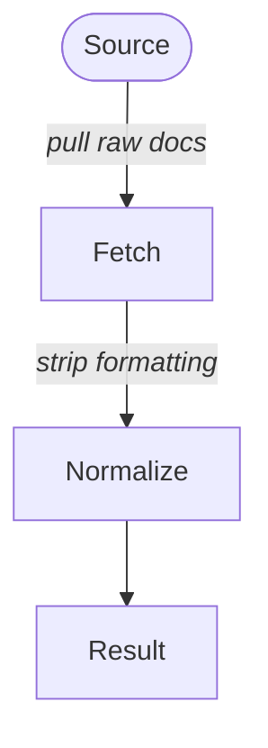

---

### Sequence Diagram

**Participants:** `participant A as Alice` or `actor A as Alice`

**Message types:** `->>` solid arrow, `-->>` dotted arrow, `-x` cross,
`-)` open arrow. Add `+`/`-` for activate/deactivate: `A ->>+ B: msg`

**Blocks:** `loop`, `alt`/`else`, `opt`, `par`/`and`, `critical`/`option`,
`break`, `rect` (highlight)

**Notes:** `Note right of A: text`, `Note over A,B: text`

**Other:** `autonumber`, `box Group` ... `end`

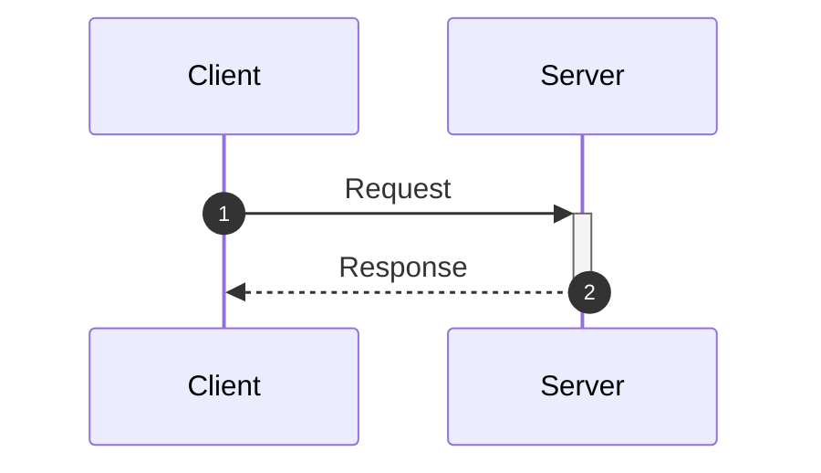

---

### Class Diagram

**Visibility:** `+` public, `-` private, `#` protected, `~` internal

**Annotations:** `<<interface>>`, `<<abstract>>`, `<<enumeration>>`

**Relationships:**
- `A <|-- B` inheritance, `A *-- B` composition, `A o-- B` aggregation
- `A --> B` association, `A ..> B` dependency, `A ..|> B` realization
- Cardinality: `A "1" --> "*" B : label`

**Generics:** use tildes: `List~Animal~`

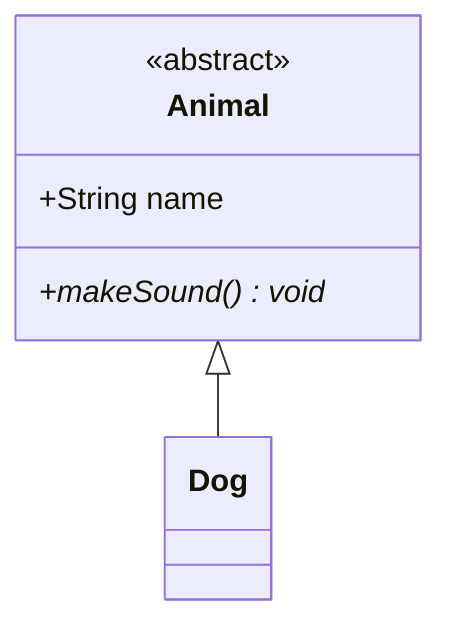

---

### State Diagram

**Identifier:** `stateDiagram-v2`

**Special states:** `[*]` = start/end

**Constructs:** composite states (nested `state Name { ... }`),
`<<choice>>`, `<<fork>>`, `<<join>>`, concurrency (`--` separator),
notes (`note right of State`)

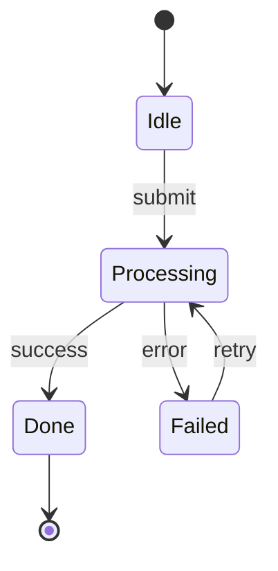

---

### Entity Relationship Diagram

**Cardinality notation:** `||` exactly one, `o|` zero or one,
`}|` one or more, `}o` zero or more

**Attributes:** `type name PK`, `type name FK`, `type name UK`

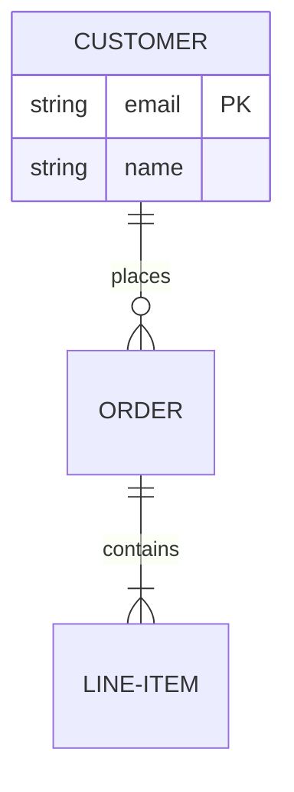

---

### User Journey

**Format:** `Task name: score: actor1, actor2`
(score 1-5, red to green)

**Sections:** `section Name` groups tasks into phases

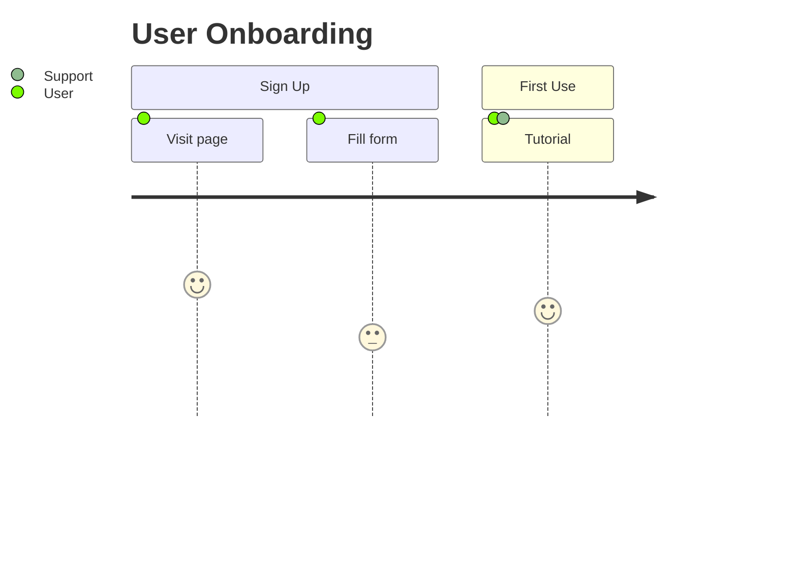

---

### Gantt

**Task syntax:** `Task : [status], [id], start, end_or_duration`

**Status markers:** `done`, `active`, `crit`, `milestone`
(combinable: `crit, done`)

**Dependencies:** `after taskId`

**Key directives:** `dateFormat`, `axisFormat`, `tickInterval`,
`todayMarker off`, `excludes weekends`

**Gotchas:**
- Always assign explicit task IDs to every task (`c1`, `w1`, etc.).
  Without IDs, `crit` or other status keywords cause the parser to
  misinterpret numeric start values as task IDs.
- `dateFormat X` (Unix timestamps) misparses small values — use
  `dateFormat YYYY-MM-DD HH:mm` with real datetimes instead.
  Map numeric positions to minutes/hours within a single day for
  proportionally accurate span diagrams.
- To hide axis labels, set `tickInterval` larger than the data range
  (e.g. `tickInterval 1week` for data spanning only hours).
- `axisFormat " "` renders literal quotes. Empty `axisFormat` renders
  garbled section names. Neither hides the axis cleanly.

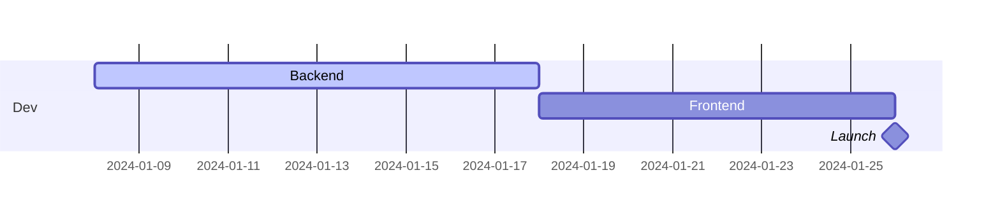

---

### Pie Chart

**Keywords:** `pie`, optional `showData`, optional `title`

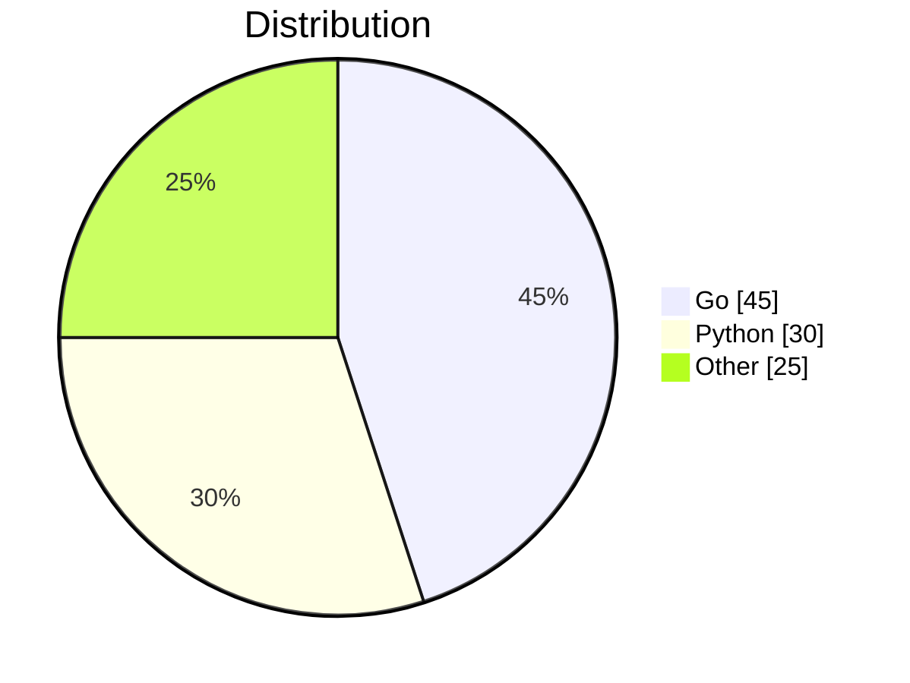

---

### Quadrant Chart

Axes are 0-1 normalized. Quadrants numbered counter-clockwise
from top-right (1) to bottom-right (4).

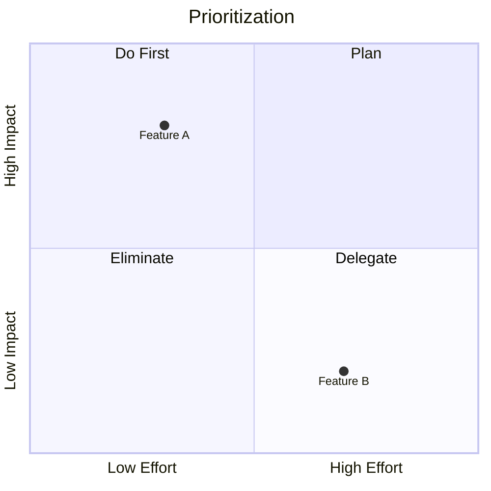

---

### Requirement Diagram

**Requirement types:** `requirement`, `functionalRequirement`,
`interfaceRequirement`, `performanceRequirement`,
`physicalRequirement`, `designConstraint`

**Relationships:** `contains`, `copies`, `derives`, `satisfies`,
`verifies`, `refines`, `traces`

```mermaid
requirementDiagram
    requirement Auth {
        id: REQ-001
        text: Users must authenticate via OAuth2
        risk: high
        verifymethod: test
    }
    element AuthService {
        type: microservice
    }
    AuthService - satisfies -> Auth
```

---

### Gitgraph

**Commands:** `commit`, `branch`, `checkout`, `merge`, `cherry-pick`

**Commit options:** `id:`, `tag:`, `msg:`,
`type: NORMAL | REVERSE | HIGHLIGHT`

**Direction:** `gitGraph` (LR default) or `gitGraph TB:`

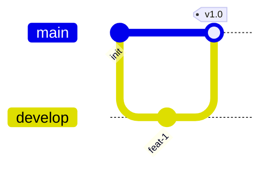

---

### C4 Diagrams

**Levels:** `C4Context`, `C4Container`, `C4Component`,
`C4Dynamic`, `C4Deployment`

**Element macros:** `Person(alias, label, descr)`,
`System(alias, label, descr)`, `Container(alias, label, techn, descr)`,
`ContainerDb(...)`, `ContainerQueue(...)`, `Component(...)`
— add `_Ext` suffix for external systems.

**Boundaries:** `System_Boundary(alias, label) { ... }`,
`Enterprise_Boundary(...)`, `Container_Boundary(...)`

**Relationships:** `Rel(from, to, label, techn)`,
directional: `Rel_U`, `Rel_D`, `Rel_L`, `Rel_R`, bidirectional: `BiRel`

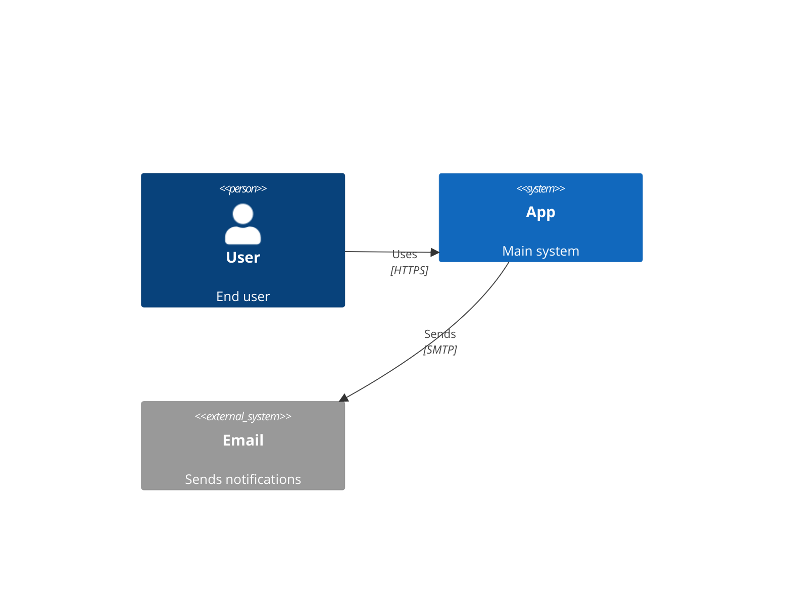

---

### Mindmap

Indentation-based hierarchy. No arrows needed.

**Node shapes:** `id` default, `(rounded)`, `((circle))`,
`)bang(`, `{{hexagon}}`, `[square]`

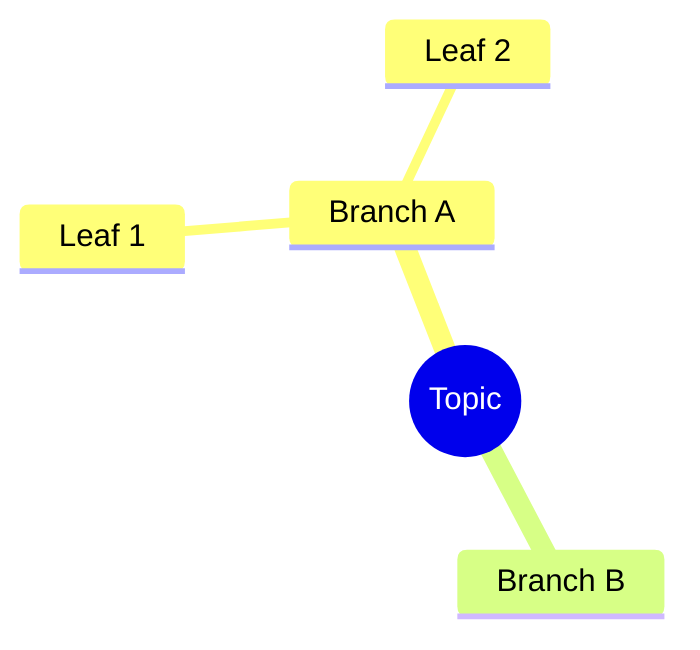

---

### Timeline

**Format:** `Time Period : Event1 : Event2`

**Sections:** group time periods into phases.

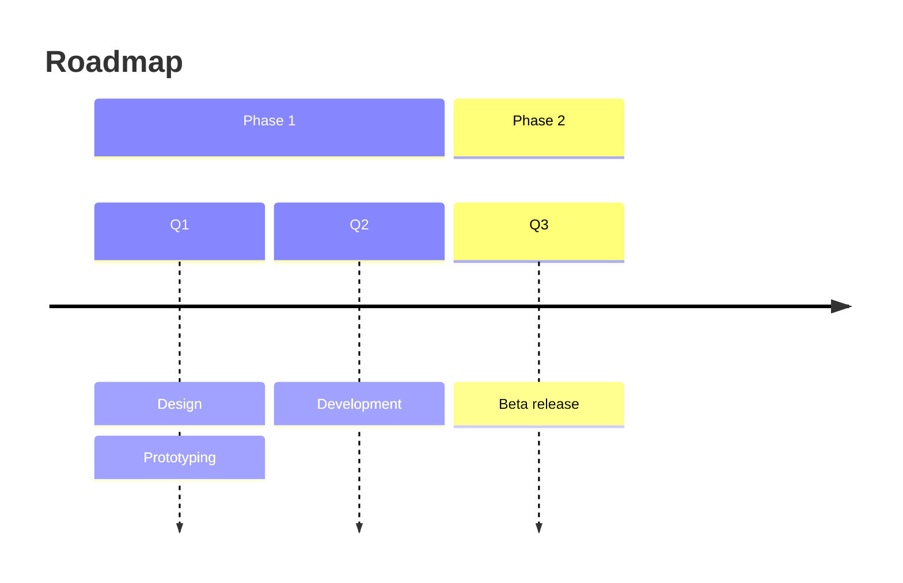

---

### ZenUML

Code-like syntax for sequence diagrams with control flow.

**Participant stereotypes:** `@Actor`, `@Database`, `@Boundary`,
`@Entity`, `@Control`

**Control flow:** `if/else`, `while`, `for`, `try/catch/finally`,
`par`, `opt`

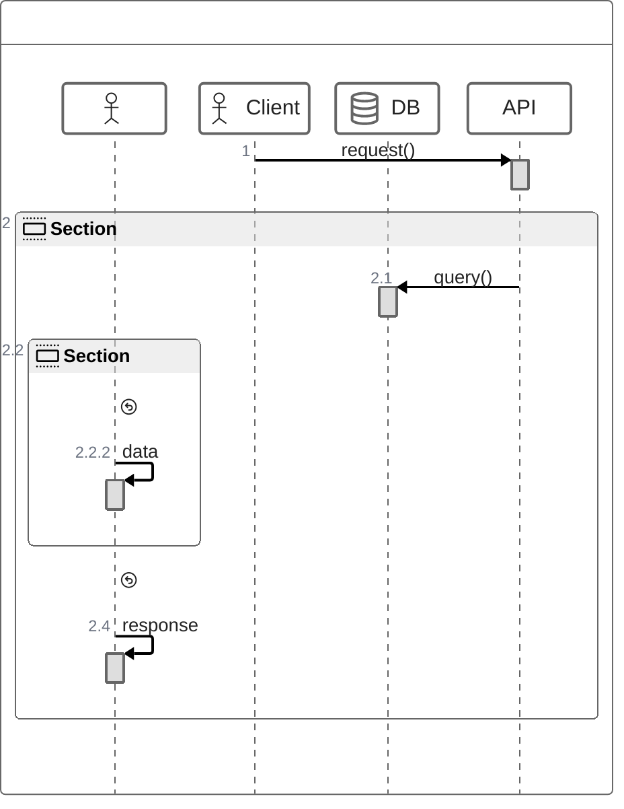

---

### Sankey

CSV-like format: `Source,Target,Value` per line.

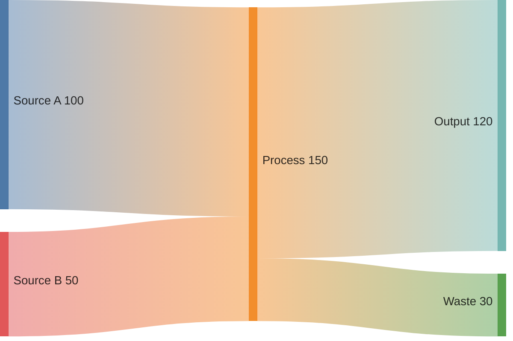

Config: `showValues`, `nodeAlignment` (justify/left/right/center),
`linkColor` (gradient/source/target/hex).

---

### XY Chart

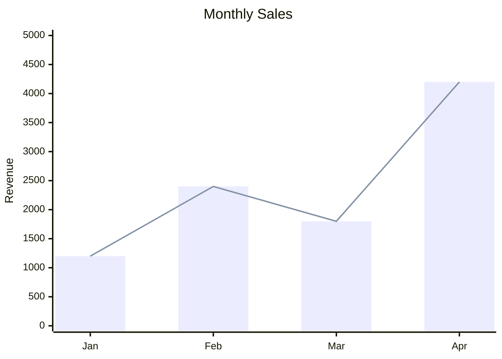

Supports `xychart-beta horizontal` for horizontal orientation.

---

### Block Diagram

Grid-based layout with `columns N`. Blocks span columns with `:N`.
Use `space` or `space:N` for empty cells.

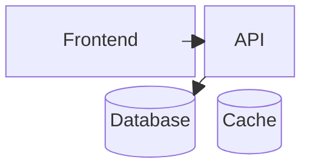

---

### Packet Diagram

Bit-range field definitions for protocol headers.

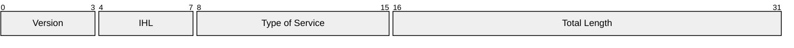

Config: `bitsPerRow` (default 32), `showBits`, `rowHeight`, `bitWidth`.

---

### Kanban

Columns at top indent, cards indented below.

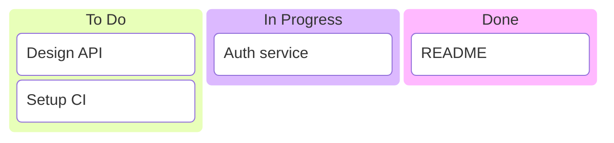

Cards support metadata: `@{ assignee: "Alice", priority: "High" }`

---

### Architecture (beta)

**Groups:** `group id(icon)[Label] in parent`

**Services:** `service id(icon)[Label] in group`

**Edges:** `svc1:R --> L:svc2` (directions: T, B, L, R)

**Junctions:** `junction id in group` (4-way connectors)

**Default icons:** `cloud`, `database`, `disk`, `internet`, `server`
(also supports iconify.design icons)

```mermaid
architecture-beta
    group api(cloud)[API Layer]
    service gw(server)[Gateway] in api
    service db(database)[Database]
    gw:R --> L:db
```

---

### Radar (beta)

**Axes:** `axis id1["Label1"], id2["Label2"]`

**Curves:** `curve name{val1, val2, ...}` or
`curve name{axis1: val, axis2: val}`

Config: `ticks`, `max`, `min`, `graticule` (circle/polygon),
`showLegend`.

```mermaid
radar-beta
    axis Go, Python, Rust, Java
    curve "Dev A"{80, 70, 50, 60}
    curve "Dev B"{60, 90, 70, 40}
```

---

### Treemap (beta)

Indentation-based hierarchy. Leaf nodes have `: value`.

```mermaid
treemap-beta
"Revenue"
    "Product A": 500
    "Product B": 300
"Costs"
    "Operations": 200
```

Config: `padding`, `showValues`, `valueFormat` (d3 specifiers).

---

### Venn (beta)

**Sets:** `set id["Label"]` — optional `:N` for sizing

**Unions:** `union A,B` — creates intersection region

**Labels inside:** `text "label"` inside set/union

**Styling:** `style` statements for fill, stroke, opacity

```mermaid
venn-beta
    set A["Frontend"]
    set B["Backend"]
    union A,B
```

---

### Mermaid layout control

Use frontmatter config (directives are deprecated since v10.5.0):

~~~markdown
```mermaid
---
config:
  flowchart:
    curve: stepBefore
    diagramPadding: 20
  sequence:
    mirrorActors: false
    messageAlign: left
    actorMargin: 80
---
flowchart TD
    A[Step 1] --> B[Step 2]
```
~~~

Key layout options:

**Flowcharts:**
- Direction: `TD` (top-down), `LR` (left-right), `BT`, `RL`
- `curve`: `linear`, `basis`, `stepBefore`, `cardinal`
- `diagramPadding`, `useMaxWidth`
- Subgraphs for grouping (but: if a subgraph node links outside,
  its direction is overridden by the parent)

**Sequence diagrams:**
- Actor ordering: declare `participant` lines in desired order
- `actorMargin`, `messageMargin`, `noteMargin` for spacing
- `mirrorActors`: show actors at top and bottom
- `noteAlign`: left, center, right

### When NOT to use Mermaid

- Many nodes/boxes — Mermaid's auto-layout becomes unpredictable and
  produces cluttered or oddly routed diagrams.
- You need exact character-level positioning of nodes.
- The diagram has overlapping ranges or spans (e.g. sliding windows)
  — use a gantt chart or Unicode box-drawing instead.
- Nodes must be at specific relative positions that the layout
  engine won't produce.
- The target renderer doesn't support Mermaid.

In these cases, offer alternatives: Unicode box-drawing (Part 3) or
one of the lightweight rendered engines (Part 2).

---

## Part 2: Lightweight Rendered Diagrams

These engines are simpler than Mermaid and supported by some editors
(Typora, some VS Code extensions). They have limited layout control
but produce clean output for simple cases.

### js-sequence (sequence diagrams)

Uses ` ```sequence ` code blocks:

~~~markdown
```sequence
Alice->Bob: Hello Bob, how are you?
Note right of Bob: Bob thinks
Bob-->Alice: I am good thanks!
```
~~~

- Solid arrows: `->`, dashed arrows: `-->`
- Notes: `Note left of`, `Note right of`, `Note over`
- Theme via CSS: `--sequence-theme: simple | hand`

### flowchart.js (flowcharts)

Uses ` ```flow ` code blocks:

~~~markdown
```flow
st=>start: Start
op=>operation: Your Operation
cond=>condition: Yes or No?
e=>end

st->op->cond
cond(yes)->e
cond(no)->op
```
~~~

Node types: `start`, `end`, `operation`, `condition`, `inputoutput`,
`subroutine`.

### Limitations

- Not part of CommonMark or GFM — only work in renderers that bundle
  these libraries.
- Very limited styling and layout control.
- No subgraphs, no config directives.

---

## Part 3: Unicode Box-Drawing Diagrams

Create diagrams inside fenced code blocks using Unicode box-drawing
characters. The priority is **correct alignment** — every vertical
line must land in the same column across all rows.

## Character Set

Boxes:
  corners:   ┌ ┐ └ ┘
  sides:     │ ─
  junctions: ├ ┤ ┬ ┴ ┼

Arrows — use plain ASCII for arrows, they are safer across renderers:
  v  ^  <  >

Connectors:
  vertical:   |
  horizontal: ─ (or - when mixing with ASCII arrows)

## Construction Rules

### 1. Fixed-width boxes

Every box must have its content padded to the SAME inner width.
Decide the inner width FIRST, then fill every line to that width.

Good:
```
┌──────────────┐
│ Vector Store │
│ (rag_chunks) │
└──────────────┘
```

Bad — right edge misaligned because content has different lengths:
```
┌──────────────┐
│ Vector Store│
│ (rag_chunks)│
└──────────────┘
```

### 2. Build boxes line by line with column counting

Before writing a box, determine:
- Start column (0-indexed from left margin)
- Inner width (longest content line + padding)
- Total width = inner width + 2 (for the side chars)

Then verify: the `│` or `┐` or `┘` on the right edge must be at
column = start + total_width - 1 on EVERY line.

### 3. Vertical flow diagrams

Use a consistent center column for the flow pipe.
All boxes should have the same width for visual consistency.

```
Source
   |
   v
┌────────┐
│ Step 1 │  Description here
└───┬────┘
    |
    v
┌────────┐
│ Step 2 │  Description here
└───┬────┘
    |
    v
Result
```

Rules:
- The `|` connector and `v` arrow share the same column as `┬` / `┴`.
- Descriptions go AFTER the box on the same line, separated by 2+ spaces.
- All boxes share the same width when they are in the same flow.

### 4. Forks (one-to-many)

Use horizontal lines to branch. Each branch target must have its `v`
arrow directly above the interior of its box.

```
    |
    ├──────────────────┐
    v                  v
┌────────┐      ┌──────────┐
│ Left   │      │ Right    │
└────────┘      └──────────┘
```

Verify: the column of each `v` falls between the `┌` and `┐` of the
box below it.

### 5. Side-by-side boxes

When placing boxes next to each other, separate them with a consistent
gap (4-6 spaces). Each box is built independently with its own width.

### 6. Span / range diagrams (e.g. sliding windows, timelines)

Do NOT use nested boxes for overlapping ranges — they are nearly
impossible to align. Use a horizontal-span notation instead:

```
|<---------- total (800 tokens) ---------->|

|<---- window 1 (512 tokens) ---->|
                            |<--->| overlap
                            |<---- window 2 (512 tokens) ---->|
```

### 7. Tables

Use Markdown tables, not ASCII-art tables. Markdown tables are
auto-aligned by renderers.

### 8. Avoid (in box-drawing diagrams)

- Nested boxes deeper than 1 level — misalignment risk is too high.
- Unicode arrows (▼ ▲ ► ◄ →) — some renderers give them different
  widths. Use plain `v ^ < >` instead.
- Mixing box-drawing chars with plain ASCII `+---+` in the same diagram.
- Mermaid and box-drawing in the same diagram.

## Verification Checklist

Before finishing a diagram, verify:

1. Every right-edge `│` or corner is at the same column for that box.
2. Every `|` connector is at the same column as the `┬`/`┴` above/below.
3. Every `v` arrow is directly above interior space of the target box.
4. Side-by-side boxes have matching heights (pad with empty `│` lines).
5. Read the diagram **column by column** for any vertical line to confirm
   alignment — do not just eyeball it.
